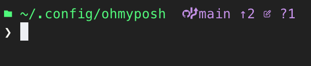
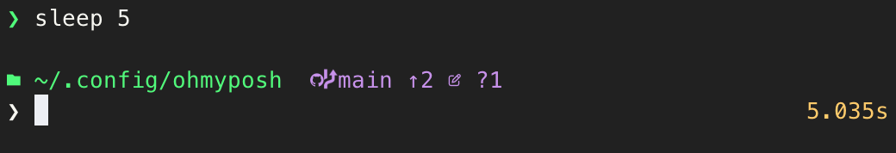

# Side-Kick Oh My Posh theme

A minimal Oh My Posh theme designed to provide essential information without visual clutter.

## Features

- **Git awareness**: Displays branch name (truncated to 25 characters), upstream status, and working/staging changes
- **Language detection**: Shows active Python virtual environment and version, plus Dart version when relevant
- **Execution time**: Displays command duration for operations exceeding 5 seconds
- **Clean design**: Simple path with short depth formatting and subtle color accents
- **Transient prompt**: Green prompt indicator that doesn't fill the terminal with repeated output

## Installation

Refer to the [Oh My Posh](https://ohmyposh.dev/docs/installation/prompt) for installation instructions.

To use this theme, refer to the [Oh My Posh customisation documentation](https://ohmyposh.dev/docs/installation/customize).

## Customization

The theme uses the following colors:
- **Path**: Green
- **Git status**: Magenta
- **Error status**: Red
- **Language info**: Cyan
- **Execution time**: Yellow
- **Prompt**: White with green transient prompt

You can customize these colors by modifying the `foreground` values in the theme file.

## Theme Structure

The prompt is organized into multiple blocks:
1. **Primary prompt** (left): Current path and git information
2. **Language info** (right): Python and Dart version information if files are present
3. **Prompt line** (left): Command prompt indicator
4. **Execution time** (right): Command duration displayed if over 5000 milliseconds (configurable) 
5. **Secondary/transient prompts**: Simplified prompt lines for multi-line input